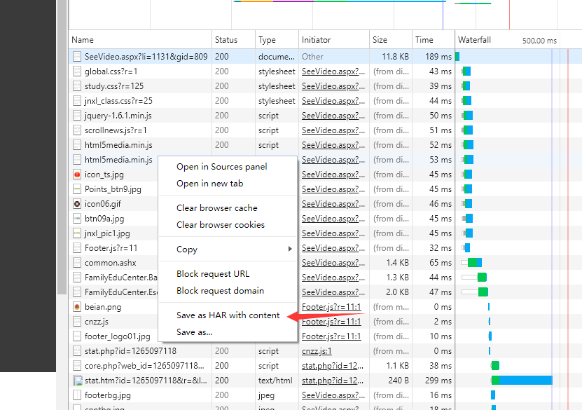
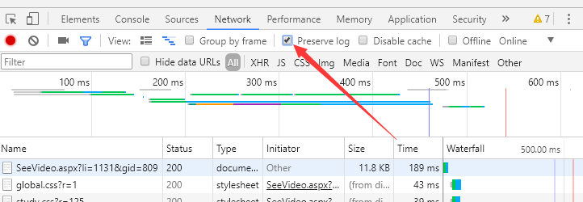

# safetree

## 运行环境
.NET Framework 4.6.1 （Win10自带，Win7可下载，WinXP不行）https://www.microsoft.com/zh-cn/download/details.aspx?id=49981

## 用法

### 建立任务目录

在safetree.exe所在目录下建立{任务名}文件夹，例如，"mytask"。

### 建立账号文件

在程序**任务目录**建立账号文件，命名为{地区}.txt，例如，chengdu.txt，这个地区名就是在当地安全教育平台子域名找。账号一竖行一个。前提是默认密码未修改。

### 获取子任务信息

#### 学期课程：

1. 选取一个账号，要求这个账号**未打开过**目标课程
2. 进入“课程中心”进入，进入课程。
3. 打开F12，切到network选项卡。
4. 对“完成安全作业”按钮右键，复制链接地址。
5. 在当前页的地址栏粘贴，转到。
6. 完成练习。
7. 对着F12弹出来的东西右键，保存har，如图。

#### 专题活动：

1. 选择未做过的专题，打开，然后f12，勾选“preserve log”

2. 完成专题。首先是个类似于签到的按钮。然后如果有问卷就做，没问卷就什么也别干，即使有其他的也别去做。

3. 保存HAR文件。

### 保存子任务

将获取的.har文件放进**任务目录**，一个任务目录里可以

### 运行程序

在程序所在目录，打开cmd，执行：
> safetree.exe {任务名称}

例如：
> safetree.exe mytask

### 修补抽风的
服务器可能会抽风，导致个别完成不了。